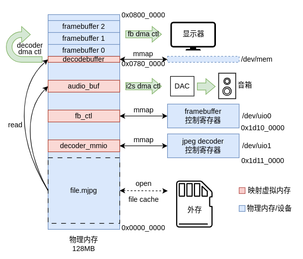

# complex_mp

NSCSCC 2023 Lain Core 项目Linux用户态驱动程序，mjpg视频播放器。

基于 ultraembedded解码器 和 ALSA I2S控制器 开发，通过多进程零拷贝实现音画同步的视频播放。

## 设计思路

## 使用方式

### 依赖

- 硬件（ [LainChip/complex_soc](https://github.com/LainChip/complex_soc) ）
  - 加入Xilinx AXI TFT Controller（图像输出）
  - 加入ultraembedded解码器（进行过相应修改以适配vga输出）
  - 加入Xilinx ALSA Audio I2S 相关IP核 （音频输出）
- 软件
  - Linux 启用uio驱动（ [LainChip/la32r-Linux](https://github.com/LainChip/la32r-Linux) ）
  - 构建 alsa 等项目所需库文件

### 构建

- 构建mediaplayer：`./build.sh` 
- 构建mjpg文件：使用FPGAmp工具
- 开发板上使用：`mediaplayer <video_file.mjpg> <fps>`

## 参考资料

- [ultraembedded/core_jpeg_decoder](https://github.com/ultraembedded/core_jpeg_decoder)
- [ultraembedded/FPGAmp](https://github.com/ultraembedded/FPGAmp)
- [Xilinx ALSA Audio I2S Driver](https://xilinx-wiki.atlassian.net/wiki/spaces/A/pages/18841805/Xilinx+ALSA+Audio+I2S+driver)
- [Xilinx AXI TFT Controller](https://www.xilinx.com/products/intellectual-property/axi_tft_controller.html#overview)